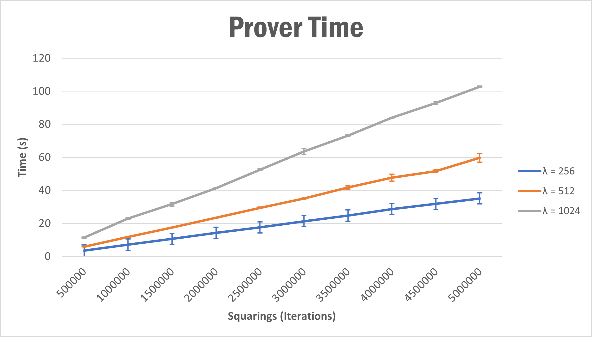
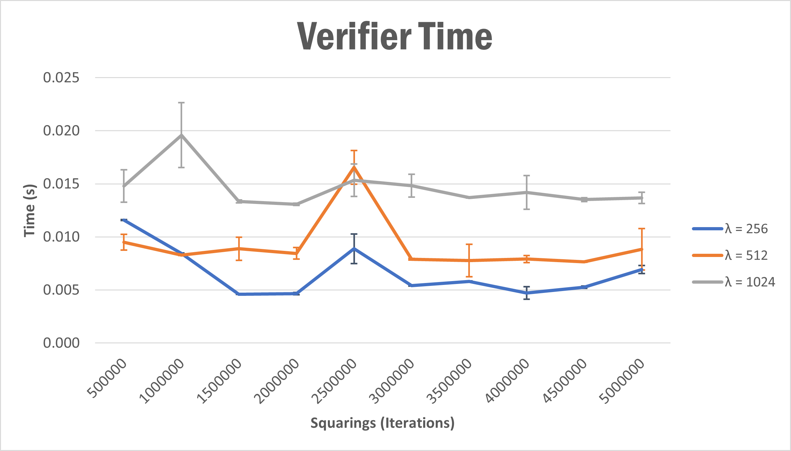

# VDF
On this repository I will explore proposals and implementations of Verifiable Delay Functions. 

A VDF takes time `T` in being evaluated, even with multiprocesing. The result is efficiently verifiable (poly *log `T`*). Is composed by 3 main algorithms.

- __Setup (λ,T) → pp__: Given a security parameter *λ* and difficulty time *T*, establish the public parameters to the correct functionality of VDF.

- __Eval (pp,x) → (y,π)__: Given an input *x* and the public parameters, makes a procesing that takes time *T*, producing an output *y* and a proof *π*, which one allows to verify the result quickly.

- __Verify (pp,x,y,π) → {Yes, No}__: Has the job of verify efficiently the result, returning *Yes* if *y* is the result of passing *x* as input to prove, with the same public parameters. Otherwise returns *No*.

This kind of function were proposed by Dan Boneh et. al. on [1](#References).

## Chia VDF
Based on Wesolowski's proposal, has the following main algorithms:

- **Create Discriminant** (`create_discriminant`): This function receives two inputs, a *challenge* and the *size* of discriminant to be created. After some computation, returns a valid __negative__ discriminant.
    - But, what does this function exactly? Internally it calls another function named `HashPrime`, which one receives the *challenge* as a *seed*, *size* as a *length*, and also another parameter more named *bitmask*, which is always the vector `{0,1,2, length-1}`. 
    - `HashPrime` generates a random psuedoprime using the hash and check method:
        - Randomly chooses x with bit-length *length*, then applies a mask
        - `(for b in *bitmask*) { x |= (1 << b) }`
        - Then return x if it is a psuedoprime, otherwise repeat.
    - Note that `HashPrime` returns a positive number, so it is mutiplied by *-1*.

- **Prove** (`prove`):

## Time Exec
On script `test.py` we variate the size of discriminant (λ) in range `[256, 512, 1024]`, meanwhile we also veriante the number of squarings (T) in range `[500k, 1000k, 1500k, ..., 5000k]`. For every pair, the experiment is repeated 10 times, in order to ensure a robust result.

The results are the following.

### Prover
In prover side, the function that produces the output of the VDF takes linear increasement as we see in the following graphic. We also include the standard desviation to provide more information of the behavior.

If we do a linear regression of each line, we obtain that:
- `λ=256` *t = 7E-06T + 0.0574*
- `λ=512` *t = 1E-05t - 0.0924*
- `λ=1024` *t = 2E-05T + 1.5936*

### Verifier
We also do the same for verification time.

## References
- [1] D. Boneh, J. Bonneau, B. Bünz, B. Fisch, «[Verifiable Delay Functions](https://eprint.iacr.org/2018/601.pdf)» 2018.

- [2] B. Wesolowski, «[Efficient Verifiable Delay Functions](https://eprint.iacr.org/2018/623.pdf)» EUROCRYPT, 2019.

- [3] K. Pietrzak, «[Simple Verifiable Delay Functions](https://eprint.iacr.org/2018/627.pdf)» de ITCS, 2019.(

- [4] L. D. Feo, S. Masson, C. Petit, A. Sanso «[Verifiable Delay Functions from Supersingular Isogenies and 
Pairings](https://eprint.iacr.org/2019/166.pdf)» ASIACRYPT, 2019.

- [5] D. Boneh, B. Bünz, B. Fisch, «[A Survey of Two Verifiable Delay Functions](https://eprint.iacr.org/2018/712.pdf)» 2018.

- [6] L. Long, «[Binary Quadratic Forms](https://raw.githubusercontent.com/Chia-Network/chiavdf/main/classgroups.pdf)» Chia VDF Competition Guide, 2019.

Also linked the Official [Chia VDF](https://github.com/Chia-Network/chiavdf) repository on GitHub.

Additional information on [VDF Research page](https://vdfresearch.org/).
